# mkit_input_voucher

 

**Unofficial Tools** untuk Software Pulsa Otomax yang dikembangkan oleh **mkit team**. Aplikasi ini dibuat sebagai *enhancement/addon* untuk mempermudah, mempercepat, dan memvalidasi sistem input voucher fisik ke database Otomax.
Beberapa Agentic AI yang di gunakan saat development Project  ini adalah `Claude CLI` `Gemini CLI` `CODEX`

> ⚠️ **DISCLAIMER:** Aplikasi ini **TIDAK UNTUK DEPLOYMENT PUBLIC**. Dikhususkan sebagai *internal tools* (Local Use Only) untuk menjaga keamanan data transaksi.

---

## 📖 Background

Proses input voucher fisik (gesek) ke server pulsa seringkali menjadi tugas yang memakan waktu (bottleneck) dan rentan kesalahan manusia (*human error*).

Addon ini dibangun untuk menyelesaikan masalah berikut:

* **🚀 Faster Input:** Menggantikan input manual satu-persatu dengan metode *bulk* (CSV/TXT) dan otomatisasi.
* **🛡️ Faster Validation:** Mempermudah CS memvalidasi fisik vs data digital sebelum masuk ke Core System.
* **✅ Faster Verification:** Integrasi (opsional) dengan addon **Otoplus** untuk mengecek status voucher *sebelum* disimpan/validasi ulang.

---

## ✨ Key Features

Aplikasi ini memiliki fitur *Funneling Input*, dimana berbagai metode input akan bermuara pada satu proses validasi yang sama:

* **📂 Upload CSV | TXT:** Support predefined template untuk input massal ribuan voucher.
* **📝 Form Input:** Antarmuka input manual yang ergonomis untuk input satuan/kecil.
* **📷 OCR (Optical Character Recognition):** Auto-detect nomor SN/Voucher dari upload foto fisik.
* **🤖 Agent AI:** Full E2E parsing dari foto voucher menggunakan AI (*Powered by Pydantic AI*).
* **📊 Stock Monitoring:** Dashboard real-time untuk cek stok dan status voucher fisik.
* **🔎 API Search Photo:** Pencarian bukti foto voucher (Integrasi Telegram Bot - *External Server*).
* **🔐 RBAC System:** Multi-account session dan role management (Planned for Next Release).

---

## ⚙️ System Workflow

Berikut adalah alur data dari berbagai *channel input* menuju *Core Otomax*:

```mermaid
%%{init: {'theme':'base', 'themeVariables': { 'primaryColor':'#f0f4f8','primaryTextColor':'#1a202c','primaryBorderColor':'#cbd5e0','lineColor':'#718096','secondaryColor':'#e2e8f0','tertiaryColor':'#edf2f7','fontSize':'14px','fontFamily':'Inter, system-ui, sans-serif'}}}%%

graph LR
    %% Modern minimal styling
    classDef inputNode fill:#dbeafe,stroke:#3b82f6,stroke-width:1.5px,rx:8,color:#1e40af
    classDef aiNode fill:#fae8ff,stroke:#a855f7,stroke-width:1.5px,rx:8,color:#7e22ce,stroke-dasharray:4 4
    classDef processNode fill:#fef3c7,stroke:#f59e0b,stroke-width:1.5px,rx:8,color:#b45309
    classDef dbNode fill:#d1fae5,stroke:#10b981,stroke-width:1.5px,color:#047857
    classDef criticalNode fill:#fee2e2,stroke:#ef4444,stroke-width:2.5px,rx:8,color:#991b1b
    classDef apiNode fill:#e9d5ff,stroke:#8b5cf6,stroke-width:1.5px,rx:8,color:#6b21a8
    classDef futureNode fill:#f3f4f6,stroke:#9ca3af,stroke-width:1px,rx:8,color:#6b7280,stroke-dasharray:3 3

    %% Security Layer
    subgraph Security["🔐 Security Layer"]
        direction TB
        RBAC([Multi-Account & RBAC])
    end

    %% Input Channels
    subgraph Sources["📥 Input Channels"]
        direction TB
        CSV[📂 CSV/TXT Upload]
        Form[📝 Manual Form]
        OCR[📷 OCR Scanner]
        AI[🤖 AI Parser]
    end

    %% Processing Core
    subgraph Core["⚙️ Processing Engine"]
        direction TB
        Normalize[Data Normalization]
        Validate{Validation Check}
        Staging[(Staging DB)]
        Preview[User Review]
        BulkIns{{Bulk Insert}}
    end

    %% External Services
    subgraph External["📡 External Services"]
        APISearch[🔎 Photo Search API]
    end

    %% Core System
    OtomaxDB[(🗄️ Otomax Core DB)]

    %% Flow connections
    RBAC -.-> Sources

    CSV --> Normalize
    Form --> Normalize
    OCR --> Normalize
    AI --> Normalize

    Normalize --> Validate
    Validate -->|✓ Valid| Staging
    Validate -->|✗ Invalid| ErrorLog[Error Log]

    Staging <--> Preview
    Staging -.-> APISearch
    Preview --> BulkIns
    BulkIns ==> OtomaxDB

    %% Apply modern styles
    class CSV,Form,OCR inputNode
    class AI aiNode
    class Normalize,Validate,Preview,BulkIns processNode
    class Staging,OtomaxDB dbNode
    class RBAC,ErrorLog futureNode
    class OtomaxDB criticalNode
    class APISearch apiNode
```

## ✅ Tech Stack

Berikut adalah beberapa stack yang di gunakan pada project ini , dan beberapa penjelasan terkait.

* **Backend:**
  * **Lang:** Python >= 3.13
  * **Package manager:** uv
  * **Framework:** fastapi
  * **ORM:** sqlalchemy
  * **Database Staging:** aiosqlite
  * **Database Core:** sqlserver
  * **AI agents:** pydantic AI
  * **OCR:** pytesseract

* **Tools And Quality:**
  * **Config:** pydantic-settings
  * **Logging:** Loguru
  * **Linter/Formatter:** Pyright, Ruff, SonarLint, CodeRabbit
  * **Commit:** Pre-commit
  * **Testing:** Pytest and related plugin

* **Frontend (Server-Side Rendered):**
  * **Template Engine:** Jinja2 (Integrated with FastAPI)
  * **Interactivity:** HTMX (High-performance HTML over wire)
  * **Client State:** Alpine.js (Minimalist JS framework)
  * **Styling:** Tailwind CSS (via CDN)
  * **Data Grid:** Tabulator.js (For high-performance bulk data preview)

Selengkap nya bisa anda check di [pyproject.toml](pyproject.toml)

## Cara Menjalankan Aplikasi

1-Pastikan Anda Sudah menginstall UV untuk package menagement / installer [klik dsini untuk panduan instalasi uv](https://docs.astral.sh/uv/getting-started/installation/)
2-rubah file .env dengan credentials anda
3-klik [start](start.bat) disini ada pengaturan dan lain lain , silahkan di check terlebih dahulu
> Jika anda menggunakan Local AI Model Untuk Ai Agent, Pastikan anda sudah menginstall Ollama
>
###

developed by

     
   
