# mkit_input_voucher

Project ini adalah Tools Pembantu Untuk Software Pulsa Otomax, Aplikasi Ini Bukan Official dan di develop oleh mkit team, Aplikasi ini di buat untuk enchance / addon untuk sistem input voucher fisik ke otomax.

`NOTE` : Aplikasi ini tidak untuk di deploy public , tetapi lebih di preferensikan untuk tools internal, dan local use only.

## background

input voucher fisik bisa menjadi task yang lumayan merepotkan, beberapa masalah yang addon ini coba selesaikan adalah :

- faster input : memberikan cara lebih cepat untuk input voucher fisik ke database
- faster validation : validasi photo voucher fisik bisa menjadi tantangan tersendiri , dengan di buat nya aplikasi ini di harapkan mampu mempercepat validasi oleh cs ke database voucher fisik
- faster verification : dengan integrasi ke addon otoplus, voucher fisik akan di check dahulu status pemakaian nya(optional feature kan be turn off jika tidak perlu) , sebelum kemudian di cari sumber photo fisik nya

## features

Aplikasi ini memilki beberapa feature sebagai tools addon otomax:
    - Upload CSV|TXT : user upload predefined template csv or txt
    - Form input : user input manual melalu form
    - OCR : user upload photos dan auto detect nomor voucher
    - Agent AI : user upload photos dan AI yang akan proses e2e
    - Check Stok dan monitor status voucher fisik
    - api search photo : di gunakan untuk mencari photo voucher fisik ( will be integrated dengan telegram bot dengan server terpisah)
    - Multi Account User Session dan RBAC (next feature / realease)

```mermaid
graph TD
    %% --- STYLING ---
    classDef input fill:#e3f2fd,stroke:#1565c0,stroke-width:2px;
    classDef ai fill:#f3e5f5,stroke:#7b1fa2,stroke-width:2px,stroke-dasharray: 5 5;
    classDef process fill:#fff3e0,stroke:#ef6c00,stroke-width:2px;
    classDef db fill:#e0f2f1,stroke:#00695c,stroke-width:2px;
    classDef otomax fill:#ffebee,stroke:#c62828,stroke-width:4px;
    classDef future fill:#f5f5f5,stroke:#9e9e9e,stroke-width:2px,stroke-dasharray: 3 3;

    %% --- FUTURE FEATURE (RBAC) ---
    subgraph Security ["🔐 Security Layer (Next Release)"]
        RBAC([Multi-Account & RBAC Session])
    end

    %% --- INPUT CHANNELS ---
    subgraph Sources ["📥 Input Channels (Voucher Fisik)"]
        direction TB
        CSV[📂 Upload CSV / TXT]
        Form[📝 Form Input Manual]
        OCR[📷 Scan OCR Image]
        AI[🤖 Agent AI Parser]
    end

    %% --- CORE LOGIC ---
    subgraph Core_Engine ["⚙️ Addon Processing Core"]
        Normalize[Normalisasi Format]
        Validate{Validasi Data?}
        Staging[(Staging DB\nTemporary)]
        Preview[👀 User Preview & Confirm]
        BulkIns{{🚀 Bulk Insert Process}}
    end

    %% --- MONITORING ---
    subgraph Monitoring ["📊 Monitoring Tools"]
        Stock[🔍 Check Stok & Status]
    end

    %% --- EXTERNAL SYSTEM ---
    OtomaxDB[("🗄️ OTOMAX CORE DB")]

    %% --- RELATIONS ---
    RBAC -.- Sources

    CSV & Form & OCR & AI --> Normalize
    Normalize --> Validate

    Validate -- "Valid" --> Staging
    Validate -- "Error" --> ErrorLog[Log Error / Reject]

    Staging <--> Preview
    Preview --> BulkIns

    BulkIns ==> OtomaxDB
    OtomaxDB -.-> Stock

    %% --- APPLY STYLES ---
    class CSV,Form,OCR input;
    class AI ai;
    class Normalize,Validate,Preview,BulkIns process;
    class Staging,OtomaxDB db;
    class RBAC,ErrorLog future;
    class OtomaxDB otomax;


```

## Tech Stack

- backend :
  - python >= 3.13
  - uv
  - ruff
  - fastapi
  - loguru
  - sqlalchemy
  - aiosqlite
  - pyodbc
  - pydantic-settings
  - pydantic AI

- frontend :
  - undecided yet

## Libraries and testing

selengkap nya untuk library ada di [pyproject.toml](pyproject.toml) beberapa di anatara nya adaah integrasi pre-commit untuk quality code dan lain lain

## License
